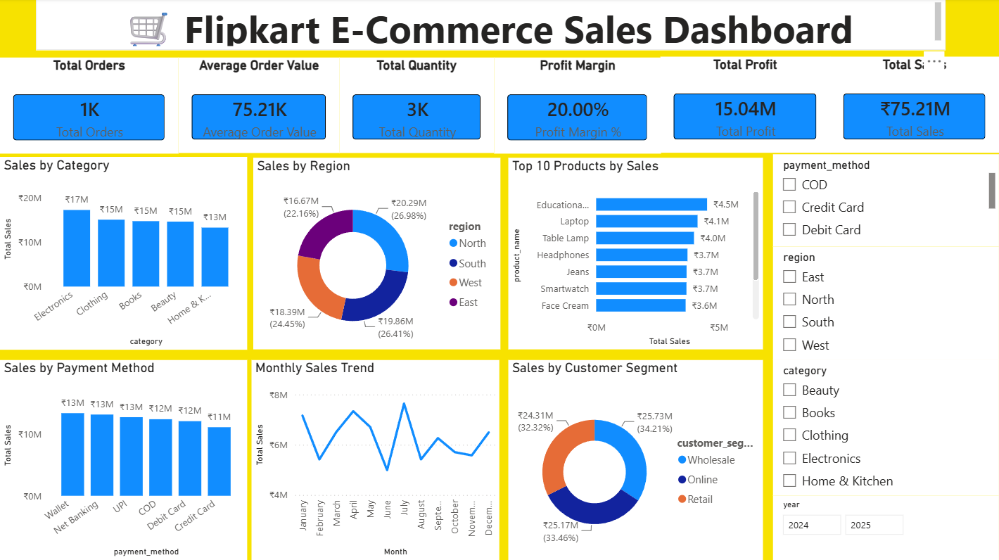
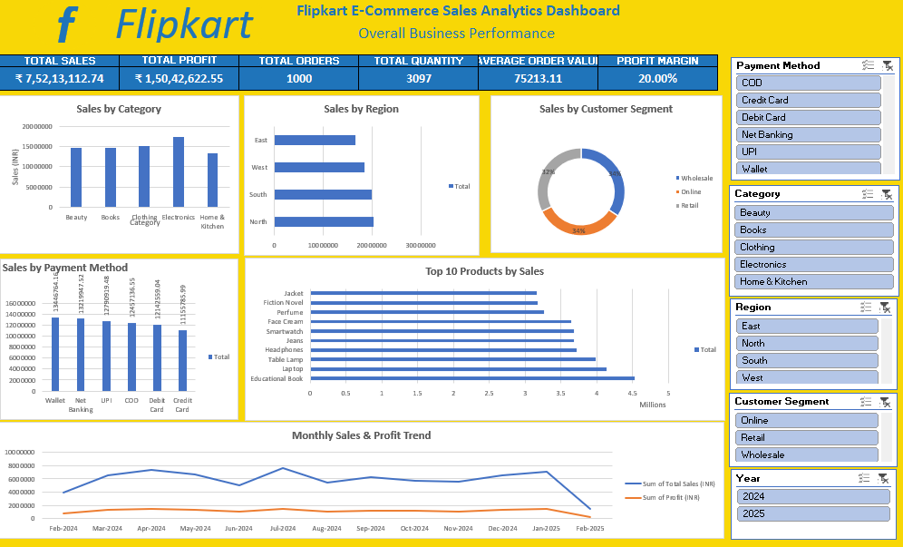

# 🛒 Flipkart E-Commerce Sales Analysis Dashboard

> An end-to-end Data Analytics project using **Excel, MySQL, and Power BI** to analyze Flipkart e-commerce sales data and build an interactive business dashboard.

---

## 📌 Project Overview

This project demonstrates a complete data analytics workflow, starting from data cleaning and SQL analysis to building an interactive Power BI dashboard. The objective is to uncover business insights from Flipkart sales data and present them through clear visualizations for decision-making.

---

## 🎯 Business Objectives

- Analyze overall sales performance
- Measure profit and profit margin
- Identify top-performing product categories
- Compare regional sales performance
- Analyze customer segments
- Evaluate payment methods
- Track sales trends using interactive dashboards

---

## 🛠️ Tools & Technologies

| Tool | Purpose |
|------|----------|
| Microsoft Excel | Data Cleaning, Pivot Tables, Dashboard |
| MySQL | Data Validation & Business Analysis |
| Power BI | Data Modeling, DAX, Dashboard & Visualization |

---

## 📂 Dataset Information

- **Dataset:** Flipkart E-Commerce Sales Dataset
- **Total Records:** 1000
- **File Format:** CSV

### Main Columns

- Order ID
- Product Name
- Category
- Region
- Customer Segment
- Payment Method
- Quantity Sold
- Total Sales (INR)
- Profit (INR)
- Order Date

---

# 📊 Key Performance Indicators (KPIs)

- 💰 Total Sales
- 📈 Total Profit
- 📦 Total Orders
- 🛒 Total Quantity Sold
- 💵 Average Order Value
- 📊 Profit Margin %

---

# 📈 Dashboard Features

- Sales by Category
- Sales by Region
- Top 10 Products by Sales
- Sales by Payment Method
- Customer Segment Analysis
- Monthly Sales Trend

### Interactive Filters

- Category
- Region
- Payment Method
- Year

---

# 🗄️ SQL Analysis

The project includes SQL queries for:

- Database Validation
- Data Quality Checks
- Sales Analysis
- Profit Analysis
- Category Performance
- Regional Performance
- Payment Method Analysis
- Customer Segment Analysis
- Product Analysis
- Business Insights

---

# 💡 Key Business Insights

- Electronics generated the highest sales.
- The North region contributed significantly to overall revenue.
- Online customers generated a major share of sales.
- Debit Card and UPI were among the most preferred payment methods.
- Monthly sales showed consistent business performance.

---

# 📷 Dashboard Preview

## Power BI Dashboard



## Excel Dashboard



---

# 📁 Project Structure

```text
Flipkart-Ecommerce-Sales-Analysis
│
├── Dataset
│   └── flipkart_sales_cleaned.csv
│
├── Excel
│   └── Flipkart_Excel_Dashboard.xlsx
│
├── SQL
│   └── Flipkart_Ecommerce_SQL_Analysis.sql
│
├── Power BI
│   └── Flipkart_Ecommerce_Dashboard.pbix
│
├── Images
│   ├── PowerBI_Dashboard.png
│   └── Excel_Dashboard.png
│
└── README.md
```

---

# 🚀 Skills Demonstrated

- Data Cleaning
- Data Validation
- SQL Query Writing
- Data Analysis
- Dashboard Development
- DAX Measures
- Data Visualization
- Business Intelligence
- Problem Solving

---

# 📌 Conclusion

This project demonstrates an end-to-end data analytics workflow using Excel, MySQL, and Power BI. It highlights practical skills in data cleaning, SQL-based analysis, dashboard development, and business insight generation.

---

## 👨‍💻 Author

**Ashish Verma**

 • LinkedIn: https://www.linkedin.com/in/ashish-verma-a80a313a5/

**Aspiring Data Analyst**

**Skills:** Excel • MySQL • Power BI# flipkart-ecommerce-sales-analysis
End-to-End Data Analytics Project using Excel, MySQL &amp; Power BI.
